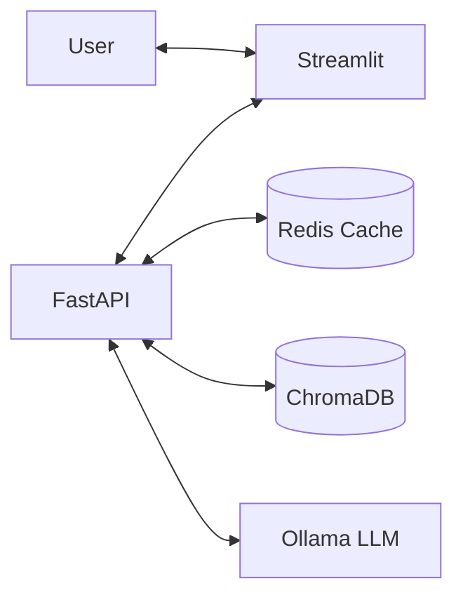

# Technical Architecture

This document provides a deep dive into the internal workings of the **RAG-SQL-Python-Assistant**.

---

## 🛰️ System Overview

The system is built as a modular RAG (Retrieval-Augmented Generation) pipeline, prioritizing local execution, low latency, and high retrieval accuracy.

---

## 🛠️ The RAG Pipeline

The retrieval process is split into several distinct stages to maximize performance:

### 1. Ingestion Layer
- **Processing**: PDFs are parsed using `PyMuPDF`.
- **Chunking**: Supports both `RecursiveCharacterTextSplitter` and `SemanticChunker`.
- **Indexing**: Documents are indexed into **ChromaDB** (Vector) and a serialized **BM25** index (Keyword).

### 2. Retrieval Layer (Hybrid Search)
The system uses an `EnsembleRetriever` to combine:
- **Dense Retrieval**: Vector similarity search in ChromaDB.
- **Sparse Retrieval**: Keyword matching via BM25.
- **Result**: A set of candidate documents that cover both semantic meaning and specific technical terms.

### 3. Optimization Layer
- **Query Expansion**: Uses a background LLM task to generate a technical description of the ideal answer (HyDE approach).
- **Reranking**: Uses `FlashRank` to re-score the top candidates. If the reranker is slow, it automatically falls back to raw hybrid scores to maintain TTFB.
- **Deduplication**: Ensures identical or near-identical chunks are removed before the LLM prompt is built.

### 4. Generation Layer
- **Streaming**: Responses are streamed token-by-token using Server-Sent Events (SSE).
- **History**: Chat history is managed using a sliding window and stored in Redis for persistence across sessions.

---

## ⚡ Caching Strategy

The system implements a multi-layer caching mechanism:

1. **Semantic Cache**: Redis stores Q&A pairs.
2. **Versioned Invalidation**: Each cache key includes a global version (`rag_cache:{version}:{query}`). When the database is reindexed, the version increments, instantly invalidating stale cache hits.
3. **Session History**: Redis stores chat history with a TTL, separate from the semantic cache.

---

## 🛰️ Observability

We use **OpenTelemetry (OTel)** to track requests through the pipeline. Every query generates a trace with the following spans:
- `cache_lookup`: Time spent checking Redis.
- `query_expansion`: Time spent on the background expansion task.
- `retrieval`: Combined time for BM25, Vector search, and Reranking.
- `llm_generation`: Time spent streaming tokens from Ollama.
