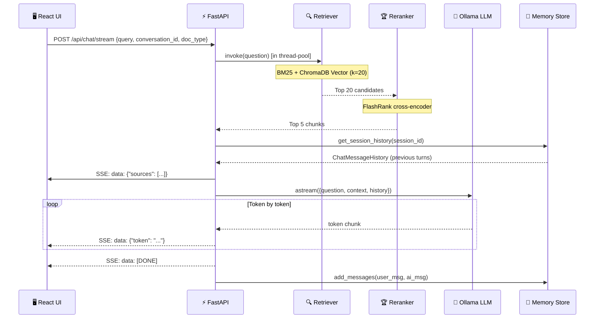

# 🔁 System Workflow — Piyu RAG v2.0

> **End-to-end technical walkthrough of the RAG pipeline, from user query to streamed response.**

---

## 📌 Overview

Piyu RAG is a **Retrieval-Augmented Generation** system. Instead of relying solely on the LLM's training knowledge, it first retrieves relevant, verifiable chunks from indexed PDF documents, then uses those chunks as context for a grounded LLM response.

```
User Query
    │
    ▼
[FastAPI Backend]
    │
    ├─► [Hybrid Retriever] ─── BM25 + ChromaDB Vector Search (Top 20)
    │         │
    │         ▼
    │   [FlashRank Reranker] ─── Cross-encoder scoring (Top 20 → Top 5)
    │         │
    │         ▼
    │   [Prompt Builder] ─── Context + History + Question → Prompt
    │         │
    │         ▼
    │   [Ollama LLM] ─── llama3.2 generates answer (streamed)
    │         │
    ▼         ▼
[Sources Metadata]   [SSE Token Stream]
    └────────────────────────┘
                │
                ▼
         [React Frontend]
         Typing effect + source citations
```

---

## 🔷 Stage 1 — User Query Intake

**Component:** `frontend/src/services/api.js` + `backend/routers/chat.py`

1. User types a question in the React chat UI
2. `useChat.js` hook calls `streamChatQuery()` with:
   - `query`: the user's question
   - `conversation_id`: UUID for the active chat session (enables memory)
   - `doc_type`: optional filter — `"mysql"` | `"python"` | `null`
3. Frontend sends `POST /api/chat/stream` to FastAPI
4. FastAPI validates the request via Pydantic `ChatRequest` model
5. SlowAPI rate limiter checks: **5 requests/minute** per IP for streaming

**Request payload:**
```json
{
  "query": "What is a SQL JOIN?",
  "conversation_id": "conv_1746289302",
  "doc_type": "mysql"
}
```

---

## 🔷 Stage 2 — RAG Pipeline Initialization

**Component:** `backend/routers/chat.py` → `backend/rag_pipeline.py`

The `RAGPipeline` is initialized once as a **singleton** when the first request arrives. It sets up:

| Component | Detail |
|:---|:---|
| **Ollama LLM** | `llama3.2`, temp=0.2, num_ctx=2048, num_predict=512 |
| **Retriever** | `EnsembleRetriever`: BM25 (weight 0.5) + ChromaDB MMR (weight 0.5), k=20 |
| **Reranker** | `FlashrankRerank`: `ms-marco-MiniLM-L-12-v2`, top_n=5 |
| **Chain** | `RunnableWithMessageHistory` wrapping `retriever | prompt | llm | StrOutputParser` |
| **Memory** | In-memory `ChatMessageHistory` dict, keyed by `session_id` |

---

## 🔷 Stage 3 — Hybrid Retrieval

**Component:** `backend/vector_store.py` → `get_hybrid_retriever()`

Since `BM25Retriever` and `EnsembleRetriever` are synchronous, they run in a **thread-pool executor** inside the async FastAPI handler to avoid blocking the event loop.

### BM25 Search (Keyword-based)
- Fetches all 178 document chunks from ChromaDB at pipeline init time
- Builds a `BM25Retriever` in-memory
- Excels at **exact keyword matches** (e.g., `"INNER JOIN"`, `"__init__"`)
- Returns top-k by BM25 score

### Vector Search (Semantic)
- Uses `sentence-transformers/all-MiniLM-L6-v2` (384 dimensions)
- Embeddings normalized (`normalize_embeddings=True`)
- Search type: **MMR (Maximal Marginal Relevance)** for diversity
- Excels at **semantic meaning** (e.g., "how to combine tables" → finds JOIN docs)

### Ensemble Fusion
```
Final Score = (0.5 × BM25 rank) + (0.5 × Vector rank)
```
- `EnsembleRetriever` uses **Reciprocal Rank Fusion (RRF)**
- Combined top-20 candidates passed to reranker

### Doc-type Filtering (optional)
If `doc_type` is provided (e.g., `"mysql"`), retrieval uses ChromaDB metadata filter:
```python
filter={"doc_type": "mysql"}   # Only MySQL Handbook chunks
```

---

## 🔷 Stage 4 — Reranking

**Component:** `backend/rag_pipeline.py` → `_initialize_reranker()`

```
Top 20 candidates from hybrid retrieval
        │
        ▼
FlashrankRerank (ms-marco-MiniLM-L-12-v2)
 - Cross-encoder: scores each (query, doc) pair independently
 - Unlike bi-encoders, cross-encoders see both texts together → higher accuracy
        │
        ▼
Top 5 most relevant chunks
```

**Why rerank?**
- Retrieval optimizes for recall (find everything relevant)
- Reranking optimizes for precision (surface the most relevant)
- `ms-marco-MiniLM-L-12-v2` is specifically trained on MS MARCO passage ranking

**Fallback:** If FlashRank fails to load (missing dependency), the system falls back to the base hybrid retriever without reranking — no crash.

---

## 🔷 Stage 5 — Context Building & Prompt Construction

**Component:** `backend/rag_pipeline.py` → `_format_docs()` + `_initialize_chain()`

The top-5 chunks are formatted into a structured context block:

```
[Source: MySQL Handbook.pdf, Page: 42]
An SQL JOIN clause is used to combine rows from two or more tables,
based on a related column between them...

[Source: MySQL Handbook.pdf, Page: 47]
INNER JOIN returns records that have matching values in both tables...
```

**System Prompt:**
```
You are an expert SQL and Python assistant. Answer using ONLY the provided 
reference material. Be concise.

Reference:
{context}

Question: {question}

Rules:
- Start with a direct answer (2-3 sentences)
- Include a code example if relevant (```sql or ```python)
- Use markdown formatting
- Do NOT hallucinate or mention "context"
- If info is insufficient, say so
```

**Conversation History** is injected via `MessagesPlaceholder`:
- Retrieved from `self.history_store[session_id]` (in-memory `ChatMessageHistory`)
- Allows the LLM to reference previous turns in the conversation
- History is scoped per `session_id` (= `conversation_id` from the request)

---

## 🔷 Stage 6 — LLM Generation & Streaming

**Component:** `backend/rag_pipeline.py` → `stream_query()`

```python
async for chunk in self.chain.astream({"question": question}, config=config):
    if chunk:
        yield f"data: {json.dumps({'token': chunk})}\n\n"
```

**LLM Configuration:**
| Parameter | Value | Effect |
|:---|:---:|:---|
| `temperature` | 0.2 | Low randomness → factual, consistent answers |
| `num_ctx` | 2048 | Context window size |
| `num_predict` | 512 | Max output tokens |
| `top_k` | 30 | Vocabulary sampling |
| `top_p` | 0.8 | Nucleus sampling |
| `repeat_penalty` | 1.1 | Reduces repetition |

---

## 🔷 Stage 7 — Server-Sent Events (SSE) Streaming

**Component:** `backend/routers/chat.py` → `StreamingResponse`

The backend sends an SSE stream with three event types:

```
# Event 1: Sources metadata (sent FIRST, before any tokens)
data: {"sources": [{"source": "MySQL Handbook.pdf", "page": 42, "content_preview": "..."}]}

# Events 2..N: Individual LLM tokens
data: {"token": "SQL"}
data: {"token": " JOINs"}
data: {"token": " combine"}
...

# Final event: Stream complete
data: [DONE]
```

**SSE Response Headers:**
```
Content-Type: text/event-stream
Cache-Control: no-cache
X-Accel-Buffering: no        ← Disables nginx proxy buffering
Access-Control-Allow-Origin: *  ← SSE CORS compatibility
```

---

## 🔷 Stage 8 — Frontend Rendering

**Component:** `frontend/src/hooks/useChat.js` + `frontend/src/components/ChatMessage.jsx`

1. `streamChatQuery()` opens the SSE stream and processes events:
   - **Sources event** → immediately updates message with citation cards
   - **Token events** → appended to `message.content` in real-time (typing effect)
   - **Error events** → shows error message + toast notification
   - **[DONE]** → `setIsLoading(false)`, persists final message to `localStorage`

2. React re-renders on every token via `setMessages()` functional update

3. `useEffect` auto-scrolls to the latest message

4. Full conversation is persisted to `localStorage` with keys:
   - `rag_conversations` → list of all conversation metadata
   - `rag_messages_<id>` → messages for each conversation
   - `rag_active_conversation` → currently selected conversation ID

---

## 🔷 Stage 9 — Session Memory

**Component:** `backend/rag_pipeline.py` → `history_store`

```python
# In-memory store (dict keyed by session_id)
self.history_store: Dict[str, ChatMessageHistory] = {}

def get_session_history(session_id: str) -> ChatMessageHistory:
    if session_id not in self.history_store:
        self.history_store[session_id] = ChatMessageHistory()
    return self.history_store[session_id]
```

- Each `conversation_id` from the frontend maps to a unique `ChatMessageHistory`
- History is injected into every chain call via `MessagesPlaceholder`
- Memory is **in-process** — resets when the backend restarts
- For persistent memory across restarts, optionally swap to `RedisChatMessageHistory` (requires Redis server)

---

## 📊 Full Data Flow Diagram



---

## 📁 Document Indexing Pipeline

Run once via `python initialize_db.py`:

```
📄 MySQL Handbook.pdf (771 KB)
        │
        ▼ PyMuPDF (fitz) extraction
71 pages of text
        │
        ▼ RecursiveCharacterTextSplitter
        │  chunk_size=800, chunk_overlap=150
        │  separators=["\n\n", "\n", ". ", " ", ""]
        ▼
71 chunks with metadata {source, page, chunk, doc_type: "mysql"}


📄 The Ultimate Python Handbook.pdf (1.7 MB)
        │
        ▼ PyMuPDF extraction
60 pages of text
        │
        ▼ RecursiveCharacterTextSplitter
        ▼
107 chunks with metadata {source, page, chunk, doc_type: "python"}


178 total chunks
        │
        ▼ HuggingFace all-MiniLM-L6-v2
        │  384-dimensional embeddings
        │  normalize_embeddings=True
        ▼
ChromaDB (./chroma_db/chroma.sqlite3)
Collection: "rag_documents"
178 embedded + indexed documents

Total time: ~38 seconds (CPU)
```

---

## 🚀 Key Modifications vs v1.0

| Component | v1.0 | v2.0 |
|:---|:---|:---|
| **Memory** | Redis (required Redis server) | In-memory dict (zero dependencies) |
| **Async retrieval** | `ainvoke()` on sync retriever (broken) | `run_in_executor()` (correct) |
| **Chain input** | `chain.invoke(question)` (wrong type) | `chain.invoke({"question": question})` |
| **SSE error handling** | `data` var out of scope in catch | Restructured scope (fixed) |
| **Health check** | Single attempt, permanent failure | 5× auto-retry every 3 seconds |
| **SSE headers** | No CORS headers | `Cache-Control`, `X-Accel-Buffering`, CORS |
| **Stream startup** | Backend started via manual terminals | `START APP.bat` one-click launcher |
| **Filter retrieval k** | k=3 | k=8 (better recall before reranking) |
| **Logging** | Basic print statements | Structured JSON logger + per-module loggers |

---

## 📈 Future Enhancements

| Feature | Priority | Description |
|:---|:---:|:---|
| Evaluation metrics display | High | Show Recall@K, Faithfulness score in UI |
| GPU acceleration | High | `device='cuda'` for embedding + inference |
| Persistent Redis memory | Medium | Survive backend restarts, cross-session history |
| Multi-document upload UI | Medium | Drag-and-drop PDF uploads from the frontend |
| User feedback loop | Medium | 👍/👎 rating per answer for quality improvement |
| Answer faithfulness score | Low | RAGAS-based hallucination detection |
| Usage analytics dashboard | Low | Query volume, latency trends, popular topics |
| Multi-language support | Low | Support non-English handbooks |
