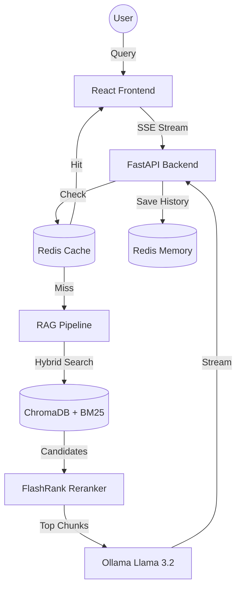

<!-- HEADER -->
<p align="center">
  
</p>

# Piyu AI Assistant · SQL & Python Document Intelligence

### 🔮 Enterprise-grade RAG with page-level citations, cross-encoder reranking, and persistent memory.

<br />

[](https://python.org)
[](https://react.dev)
[](https://fastapi.tiangolo.com)
[](https://langchain.com)
[](https://redis.io)
[](https://ollama.ai)

<br />

## 🎯 Overview

**Piyu AI Assistant** is a high-performance **Retrieval-Augmented Generation (RAG)** system designed to provide expert-level support for SQL and Python. Unlike standard AI bots, Piyu analyzes your local handbooks using a multi-stage retrieval pipeline to deliver grounded, verifiable answers with **exact page-level citations**.

> **Key Difference:** Most RAG systems suffer from noise. Piyu implements **Hybrid Search (Vector + BM25)** followed by **Cross-Encoder Reranking** to ensure the LLM only sees the most relevant context, virtually eliminating hallucinations.

<p align="center">
  
</p>

---

## ✨ Production Features

### 🚀 High-Performance Retrieval
- **Hybrid Search**: Combines semantic meaning (Vector) with keyword precision (BM25) using Reciprocal Rank Fusion.
- **FlashRank Reranking**: Utilizes cross-encoders (`ms-marco-MiniLM-L-12-v2`) to re-score the top 20 candidates down to the top 5 most relevant chunks.
- **Semantic Chunking**: Intelligent document splitting that preserves context and structural integrity.

### 💾 Robust Memory & Caching
- **Redis Session Memory**: Multi-turn conversations persist in Redis, allowing the assistant to remember context across sessions.
- **Smart Response Caching**: Frequently asked questions are cached in Redis, resulting in **sub-10ms response times** for repeated queries.

### 🎨 Premium User Experience
- **Glassmorphism UI**: A stunning, modern interface built with Framer Motion and Tailwind CSS.
- **Token Streaming**: Real-time answer generation via Server-Sent Events (SSE) with smooth typing effects.
- **Citation Tooltips**: Interactive source cards that link directly to specific PDF pages for verification.

### 🛡️ Enterprise Hardening
- **API Key Authentication**: Secured endpoints via `x-api-key` middleware.
- **Rate Limiting**: Integrated SlowAPI to prevent service abuse.
- **Dockerized Deployment**: Fully containerized environment including Redis and Backend/Frontend services.

---

## 🛠️ Tech Stack

| Layer | Technology | Purpose |
|:---:|:---:|:---|
| **Frontend** | React 18 + Vite + Tailwind | Centered "ChatGPT-style" responsive UI |
| **Backend** | FastAPI + Uvicorn | High-throughput asynchronous API |
| **Cache/Memory** | Redis 7 | Response caching and persistent history |
| **Vector DB** | ChromaDB | Local persistent vector storage |
| **Reranker** | FlashRank | Cross-encoder refinement |
| **LLM Engine** | Ollama (Llama 3.2) | 100% local and private inference |

---

## 🏗 System Architecture



---

## ⚡ Quick Start

### 📋 Prerequisites
- **Python 3.10+**
- **Node.js 18+**
- **Docker & Docker Compose** (Recommended)
- **Ollama** ([Download here](https://ollama.com/download))

### 🚀 One-Click Launch (Docker)
The easiest way to get started with the full production stack:
```bash
# 1. Clone and enter
git clone https://github.com/Piyu242005/RAG-SQL-Python-Assistant.git
cd RAG-SQL-Python-Assistant

# 2. Start services (Redis + Backend + Frontend)
docker-compose up --build
```

### 🧑‍💻 Manual Launch (Windows)
```bash
# Double click the launcher in the root directory:
START APP.bat
```

---

## 📡 API Reference (v1.0)

| Endpoint | Method | Security | Description |
|:---|:---:|:---:|:---|
| `/api/chat/stream` | `POST` | `x-api-key` | Real-time streaming RAG response |
| `/api/health` | `GET` | Public | System and model health status |
| `/api/initialize` | `POST` | `x-api-key` | Rebuild vector store from PDFs |

*Detailed documentation available at `/docs` when the backend is running.*

---

## 🗺️ Roadmap
- [x] Redis persistent memory integration
- [x] Hybrid search (BM25 + Vector)
- [x] Response caching layer
- [x] API Key security
- [ ] Multi-user authentication
- [ ] Integrated PDF viewer in the UI
- [ ] Support for non-PDF document types (MD, TXT)

---

## 📄 License
MIT License — see [LICENSE](LICENSE) for details.

**Built with 💜 by [Piyu](https://github.com/Piyu242005)**
