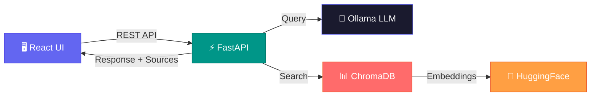

<div align="center">


# Piyu RAG · SQL & Python AI Assistant

### 🔮 Ask anything. Get answers with page-level citations. 100% local & private.

<br />

[](https://python.org)
[](https://react.dev)
[](https://fastapi.tiangolo.com)
[](https://tailwindcss.com)
[](https://ollama.ai)
[](LICENSE)
[](https://github.com/Piyu242005/RAG-SQL-Python-Assistant)

<br />

[⚡ Quick Start](#-quick-start) · [🧠 How It Works](#-how-it-works) · [📡 API](#-api-reference) · [🗺️ Roadmap](#️-roadmap)

<br />


---

</div>

<br />

## 🎯 What Is This?

> **Piyu RAG** is a production-grade **Retrieval-Augmented Generation** system. You ask a question about **SQL** or **Python**, it searches through PDF handbooks, and returns an **accurate answer with page-level source citations** — all running **locally** on your machine.

```
💬 You:   "What are SQL JOINs and when to use each type?"

🤖 Piyu:  "SQL JOINs combine rows from two or more tables based on a related column..."
          📄 Source: MySQL Handbook.pdf — Page 42
```


**No API keys. No cloud. No data leaks. Just local AI.**

<br />

## ✨ Features

<table>
<tr>
<td width="50%">

### 🧠 Intelligent Q&A
Context-aware answers powered by **llama3.2** via Ollama. Understands complex queries about SQL syntax, Python patterns, and more.

### 🔒 100% Private
Runs **entirely on your machine**. Your data never leaves your hardware. Zero API costs forever.

### 📄 Source Citations
Every answer links back to the **exact PDF page**, so you can verify and learn deeper.

</td>
<td width="50%">

### 🔍 Semantic Search
**ChromaDB** vector store with HuggingFace embeddings finds the most relevant passages — even when you don't use the exact keywords.

### 🎯 Smart Filtering
Filter by **MySQL**, **Python**, or search both handbooks simultaneously.

### 🖥️ Premium Dark UI
Deep dark theme with glow accents, smooth animations, code highlighting, and copy-to-clipboard.

</td>
</tr>
</table>

<br />

## 🛠️ Tech Stack

<div align="center">

| Layer | Tech | Why |
|:---:|:---:|:---:|
| **Frontend** | React 18 + Tailwind + Framer Motion | Premium deep dark chat UI |
| **Backend** | FastAPI + LangChain + Pydantic | REST API + RAG pipeline |
| **Vector DB** | ChromaDB + HuggingFace | Semantic search & embeddings |
| **LLM** | Ollama (llama3.2) | Free local inference |
| **PDF** | PyMuPDF + LangChain Splitters | Extract & chunk documents |

</div>

<br />

## ⚡ Quick Start

### 📋 Prerequisites

> You need these installed:

| Tool | Min Version | Get It |
|:---:|:---:|:---:|
| 🐍 Python | 3.8+ | [python.org](https://www.python.org/) |
| 📦 Node.js | 18+ | [nodejs.org](https://nodejs.org/) |
| 🦙 Ollama | Latest | [ollama.ai](https://ollama.ai/) |

<br />

### 🚀 One-Command Setup

<table>
<tr>
<td>

**Windows**
```powershell
.\setup.bat
```

</td>
<td>

**Linux / macOS**
```bash
chmod +x setup.sh && ./setup.sh
```

</td>
</tr>
</table>

> The script installs all dependencies, pulls the LLM model, processes the PDFs, and validates the system.

<br />

### 🧑‍💻 Manual Setup

<details>
<summary><b>Click to expand step-by-step instructions</b></summary>

<br />

**Step 1 — Start Ollama**
```bash
ollama serve                # Start the LLM server
ollama pull llama3.2        # Download the model (~2GB)
```

**Step 2 — Backend**
```bash
cd backend
python -m venv venv

# Activate virtualenv
venv\Scripts\activate       # Windows
source venv/bin/activate    # macOS/Linux

pip install -r requirements.txt
copy .env.example .env      # Windows (use cp on Unix)
python initialize_db.py     # Process PDFs → vector store
```

**Step 3 — Frontend**
```bash
cd frontend
npm install
```

</details>

<br />

### ▶️ Running the App

Open **3 terminals** and run:

```bash
# Terminal 1 — Ollama (skip if already running)
ollama serve

# Terminal 2 — Backend API
cd backend && venv\Scripts\activate && python main.py
# → http://localhost:8000

# Terminal 3 — Frontend
cd frontend && npm run dev
# → http://localhost:5173
```

<br />

## 💬 Try These Queries

<table>
<tr>
<td width="50%">

**🗄️ SQL Questions**
```
What are SQL JOINs and when to use each type?
How do I create a MySQL table with constraints?
Explain the SELECT statement with examples
What is database normalization?
```

</td>
<td width="50%">

**🐍 Python Questions**
```
How do Python decorators work?
What are list comprehensions?
Explain Python class inheritance
How do I handle exceptions in Python?
```

</td>
</tr>
</table>

> **💡 Pro tip:** Use the filter chips (`All` / `MySQL` / `Python`) in the chat UI to narrow your search to a specific handbook.

<br />

## 🏗 How It Works



### How a query flows:

1. **You type** a question in the chat
2. **React frontend** sends it to the FastAPI backend
3. **Semantic search** finds the most relevant chunks from ChromaDB
4. **LLM (llama3.2)** generates an answer using those chunks as context
5. **Response** is returned with the answer + source citations (PDF + page)

<br />

### 📁 Project Structure

```
piyu-rag/
├── 📂 backend/
│   ├── main.py               # FastAPI entry point
│   ├── rag_pipeline.py       # Core RAG chain
│   ├── vector_store.py       # ChromaDB manager
│   ├── document_processor.py # PDF extraction
│   ├── llm_config.py         # Ollama config
│   ├── models.py             # Pydantic schemas
│   ├── config.py             # Settings
│   ├── initialize_db.py      # DB setup script
│   └── routers/chat.py       # Chat endpoints
│
├── 📂 frontend/
│   ├── src/
│   │   ├── components/       # UI components
│   │   ├── hooks/            # Custom React hooks
│   │   ├── services/         # API client
│   │   ├── context/          # Theme context
│   │   ├── App.jsx           # Root component
│   │   └── index.css         # Design system
│   └── tailwind.config.js
│
├── 📄 MySQL Handbook.pdf
├── 📄 The Ultimate Python Handbook.pdf
├── 🔧 setup.bat / setup.sh
└── 📖 README.md
```

<br />

## 📡 API Reference

> 📘 **Interactive docs:** Visit [`http://localhost:8000/docs`](http://localhost:8000/docs) for the Swagger UI.

<br />

### `POST /api/chat` — Ask a question

<table>
<tr>
<td width="50%">

**Request**
```json
{
  "query": "What is a SQL JOIN?",
  "doc_type": "mysql"
}
```
> `doc_type` is optional. Omit to search all.

</td>
<td width="50%">

**Response**
```json
{
  "answer": "A SQL JOIN combines rows...",
  "sources": [{
    "source": "MySQL Handbook.pdf",
    "page": 42,
    "doc_type": "mysql"
  }],
  "success": true
}
```

</td>
</tr>
</table>

<br />

### Other Endpoints

| Method | Endpoint | Description |
|:---:|:---|:---|
| `GET` | `/api/health` | System status — Ollama, model, vector store |
| `GET` | `/api/documents` | Stats about indexed documents |
| `POST` | `/api/initialize` | Reprocess PDFs & rebuild vector store |

<br />

## ⚙️ Configuration

### Backend `.env`

```env
OLLAMA_BASE_URL=http://localhost:11434
OLLAMA_MODEL=llama3.2
EMBEDDING_MODEL=sentence-transformers/all-MiniLM-L6-v2
CHROMA_PERSIST_DIRECTORY=./chroma_db
CHUNK_SIZE=1000
CHUNK_OVERLAP=200
API_HOST=0.0.0.0
API_PORT=8000
```

### Frontend

API URL defaults to `http://localhost:8000`. Override with `VITE_API_URL` env variable.

<br />

## 🐛 Troubleshooting

<details>
<summary><b>❌ Ollama is not running</b></summary>

```bash
ollama serve
```
Make sure Ollama is installed and the service is active.
</details>

<details>
<summary><b>❌ Model not found</b></summary>

```bash
ollama pull llama3.2
```
Or try `mistral` for faster responses.
</details>

<details>
<summary><b>❌ Vector store not initialized</b></summary>

```bash
cd backend
venv\Scripts\activate       # or: source venv/bin/activate
python initialize_db.py
```
</details>

<details>
<summary><b>❌ Frontend can't connect to backend</b></summary>

- Ensure backend is running on port `8000`
- Check CORS settings in `backend/config.py`
- Try `http://localhost:8000/api/health` in browser
</details>

<details>
<summary><b>⏳ Slow responses</b></summary>

- Use a faster model: `ollama pull mistral`
- Reduce retrieval count (`k`) in `rag_pipeline.py`
- Increase `CHUNK_SIZE` in `.env`
</details>

<br />

## 🗺️ Roadmap

- [ ] 🔄 Streaming responses (real-time tokens)
- [ ] 💾 Conversation memory (multi-turn context)
- [ ] 🔍 Hybrid search (BM25 + semantic)
- [ ] 📤 User PDF uploads
- [ ] 🌐 Multi-language support
- [ ] 🧪 Automated test suite
- [ ] 🐳 Docker Compose deployment
- [ ] 📊 Usage analytics dashboard

<br />

## 🤝 Contributing

```
1. Fork the repo
2. Create a branch:   git checkout -b feat/my-feature
3. Commit changes:    git commit -m "feat: add streaming"
4. Push & open PR:    git push origin feat/my-feature
```

**Code style:** PEP 8 for Python · Functional components for React · [Conventional Commits](https://www.conventionalcommits.org/)

<br />

## 🙏 Acknowledgements

<div align="center">

| | Tech | Role |
|:---:|:---:|:---|
| 🦜 | [LangChain](https://langchain.com) | RAG framework |
| 🦙 | [Ollama](https://ollama.ai) | Local LLM runtime |
| 📊 | [ChromaDB](https://www.trychroma.com) | Vector database |
| ⚡ | [FastAPI](https://fastapi.tiangolo.com) | Backend framework |
| ⚛️ | [React](https://react.dev) | Frontend library |
| 🎨 | [Tailwind CSS](https://tailwindcss.com) | Utility CSS |
| ✨ | [Framer Motion](https://www.framer.com/motion) | Animations |
| 🤗 | [HuggingFace](https://huggingface.co) | Embeddings |

</div>

<br />

## 📄 License

MIT License — see [LICENSE](LICENSE) for details.

---

<div align="center">

<br />

**Built with 💜 by [Piyu](https://github.com/Piyu242005)**

**If this helped you, drop a ⭐ — it means a lot!**

<br />

<a href="https://github.com/Piyu242005/RAG-SQL-Python-Assistant">

</a>

<br /><br />

</div>
