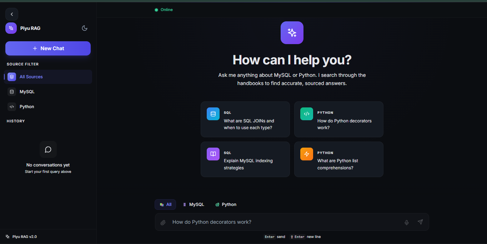

# 🚀 RAG Assistant: SQL & Python
> **An enterprise-grade, locally-hosted Retrieval-Augmented Generation (RAG) assistant for querying SQL and Python documentation.**


A powerful full-stack AI application that ingests local PDF documentation, processes it into semantic vectors, and serves hyper-accurate, hallucination-resistant answers with millisecond latency. 

---

## ✨ Features
* **Hybrid Retrieval:** Blends semantic vector search with BM25 keyword matching for maximum precision.
* **Contextual Re-ranking:** Uses cross-encoder reranking (FlashRank) to surface the most critical document chunks.
* **Streaming Responses:** Smooth, ChatGPT-style Server-Sent Events (SSE) token streaming.
* **Memory & Caching:** Redis-backed conversational memory and LLM result caching.
* **Self-Healing Architecture:** Auto-guards against context overflow and automatically intercepts empty vector store states.
* **Local & Private:** Zero data leaves your machine. Powered by Ollama (`llama3.2`) and local sentence-transformers.

---

## 🏗️ Architecture Overview

The system is decoupled into a high-performance **FastAPI** backend and a snappy **React + Tailwind** frontend:
1. **Ingestion Pipeline:** PyMuPDF extracts text -> chunked via `RecursiveCharacterTextSplitter` -> Embedded via `MiniLM` -> Stored in `ChromaDB`.
2. **Query Pipeline:** User Input -> HyDE Query Expansion -> Hybrid Search (Top 20) -> Reranker (Top 5) -> Context Trimming -> LLM Generation.
3. **Presentation:** React handles the SSE stream, formatting markdown and code blocks in real-time.

---

## 📸 Screenshots




---

## 🚀 Quick Start

### 1. Requirements
- Python 3.10+
- Node.js 18+
- [Ollama](https://ollama.ai) (with `llama3.2` pulled)
- Redis server running on port `6379`

### 2. Setup
Detailed instructions can be found in our [Setup Guide](docs/SETUP_GUIDE.md).

```bash
# Terminal 1: Initialize Database & Start Backend
cd backend
pip install -r requirements.txt
python initialize_db.py
python main.py

# Terminal 2: Start Frontend
cd frontend
npm install
npm run dev
```

---

## 📚 Documentation
- [⚙️ Setup Guide](docs/SETUP_GUIDE.md)
- [🧠 RAG Workflow Architecture](docs/RAG_Workflow.md)
- [🛜 API Reference](docs/API_REFERENCE.md)

---

## 🎯 Future Improvements
- [ ] Add Docker Compose for 1-click deployments.
- [ ] Multi-modal support (images/diagrams in PDFs).
- [ ] Expand metrics logging for LLM evaluation.

## 🤝 Contributing
Contributions are welcome! Please open an issue or submit a Pull Request if you'd like to improve the pipeline or UI.
