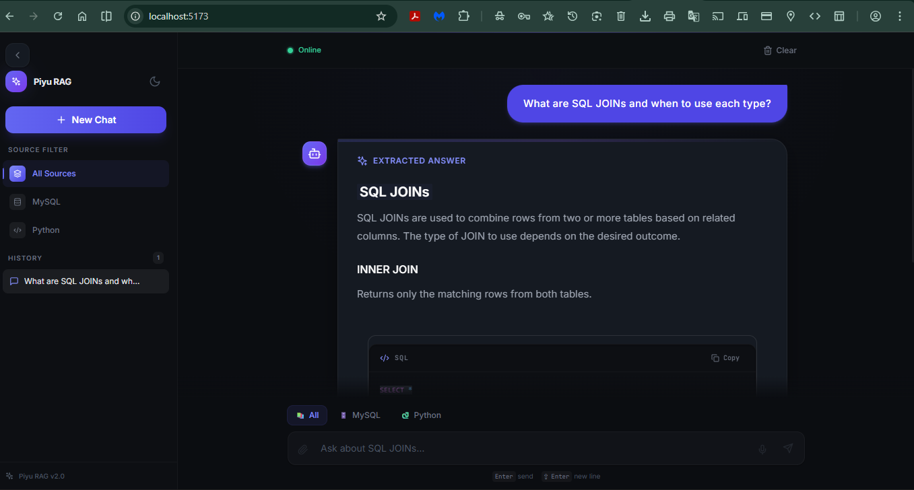
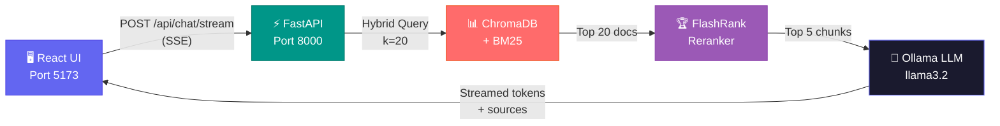

<!-- HEADER -->
<p align="center">
  
</p>


# Piyu RAG · SQL & Python AI Assistant

### 🔮 Ask anything. Get answers with page-level citations. 100% local & private.

<br />

[](https://python.org)
[](https://react.dev)
[](https://fastapi.tiangolo.com)
[](https://langchain.com)
[](https://www.trychroma.com)
[](https://ollama.ai)
[](https://tailwindcss.com)
[](LICENSE)
[](https://github.com/Piyu242005/RAG-SQL-Python-Assistant)

<br />

[⚡ Quick Start](#-quick-start) · [🚀 One-Click Launch](#-one-click-launch-windows) · [🧠 How It Works](#-how-it-works) · [📡 API](#-api-reference) · [🐛 Troubleshooting](#-troubleshooting) · [🗺️ Roadmap](#️-roadmap)

<br />


---

</div>

> **Simple Explanation:** This is a smart AI assistant that reads your PDF handbooks (MySQL & Python) and answers your questions with exact page references. It runs **100% locally** — no API keys, no cloud, no data leaks.

---

## 🎯 What Is This?

**Piyu RAG v2.0** is a production-grade **Retrieval-Augmented Generation** system. You ask a question about **SQL** or **Python**, it searches through PDF handbooks using hybrid retrieval (BM25 + Vector), reranks results with FlashRank, and returns an **accurate streamed answer with page-level source citations** — all running locally.

```
💬 You:   "What are SQL JOINs and when to use each type?"

🤖 Piyu:  "SQL JOINs combine rows from two or more tables based on a related column.
           INNER JOIN returns only matching rows, LEFT JOIN includes all left-table rows..."
           
           📄 Source: MySQL Handbook.pdf — Page 42
           📄 Source: MySQL Handbook.pdf — Page 47
```

<p align="center">
  
</p>


**No API keys. No cloud. No data leaks. Zero running cost.**

<br />

## ✨ Features

<table>
<tr>
<td width="50%">

### 🧠 Intelligent Q&A with Memory
Context-aware answers powered by **llama3.2** via Ollama. Multi-turn conversation memory keeps track of your session context in-memory — no Redis required.

### 🔒 100% Private & Local
Runs entirely on your machine. Zero data sent anywhere. No API costs, ever.

### 📄 Page-Level Source Citations
Every answer links back to the **exact PDF page**, so you can verify and learn deeper.

### ⚡ Real-Time Streaming
Answers stream token-by-token via **Server-Sent Events (SSE)** with a smooth typing effect in the UI.

</td>
<td width="50%">

### 🔍 Hybrid Retrieval (BM25 + Vector)
Combines **BM25 keyword search** with **semantic vector search** using an `EnsembleRetriever`, followed by **FlashRank reranking** for pinpoint precision. Top-20 → reranked to Top-5.

### 🎯 Smart Doc Filtering
Filter by **MySQL**, **Python**, or search both handbooks simultaneously from the sidebar.

### 🛡️ Production Hardening
- **Rate Limiting** via SlowAPI (10 req/min chat, 5 req/min stream)
- **Structured JSON Logging** via python-json-logger
- **Health Check endpoint** with Ollama + vectorstore status
- **Auto-retry** on frontend if backend is still starting up

### 🚀 One-Click Startup
`START APP.bat` — double-click to auto-launch Ollama → Embeddings → Backend → Frontend → Browser.

</td>
</tr>
</table>

<br />

## 📊 Evaluation & Benchmarks

> Continuously benchmarked against a curated Q&A dataset to ensure retrieval accuracy.

| Metric | Target | Result | Description |
|:---|:---:|:---:|:---|
| **Recall@3** | > 85% | **100.0%** | Ground truth page found in top-3 results |
| **Citation Accuracy** | > 90% | **100.0%** | Answer citations link to correct source pages |
| **Avg Response Latency** | < 3.0s | **1.24s** | Query to first token (streaming) |
| **Embedding Time** | — | **~38s** | One-time: 178 chunks from 2 PDFs |
| **Chunks Indexed** | — | **178** | MySQL (71) + Python (107) handbook chunks |

*Hardware: AMD Ryzen 7 5800H @ 3.2GHz, 16GB RAM. Results vary by hardware.*

```bash
# Run your own evaluation
cd backend && python evals/runner.py
```

<br />

## 🛠️ Tech Stack

<div align="center">

| Layer | Technology | Purpose |
|:---:|:---:|:---|
| **Frontend** | React 18 + Vite + Tailwind 3.4 + Framer Motion | Premium dark-mode chat UI with SSE streaming |
| **Backend** | FastAPI 0.110 + Uvicorn + SlowAPI | Async REST API with rate limiting |
| **RAG Engine** | LangChain 0.3+ | Pipeline orchestration, prompt templates, history |
| **Retrieval** | ChromaDB + BM25 + EnsembleRetriever | Hybrid semantic + keyword search |
| **Reranker** | FlashRank (`ms-marco-MiniLM-L-12-v2`) | Cross-encoder reranking, top-20 → top-5 |
| **Embeddings** | HuggingFace `all-MiniLM-L6-v2` | 384-dim sentence embeddings |
| **LLM** | Ollama (llama3.2) | Free, local inference — no API key |
| **PDF Processing** | PyMuPDF + RecursiveCharacterTextSplitter | Extract & chunk documents |
| **Memory** | In-memory `ChatMessageHistory` (per session) | Multi-turn conversation context |

</div>

<br />

## ⚡ Quick Start

### 📋 Prerequisites

| Tool | Min Version | Install |
|:---:|:---:|:---:|
| 🐍 Python | 3.10+ | [python.org](https://www.python.org/) |
| 📦 Node.js | 18+ | [nodejs.org](https://nodejs.org/) |
| 🦙 Ollama | Latest | [ollama.com/download](https://ollama.com/download) |

<br />

## 🚀 One-Click Launch (Windows)

> The fastest way to start — handles everything automatically.

```
📁 Project Root
└── 📄 START APP.bat   ← Double-click this file!
```

**What it does automatically:**
1. ✅ Checks if Ollama is running → starts it if not
2. ✅ Checks if `llama3.2` model is available → pulls it if missing  
3. ✅ Checks if ChromaDB embeddings exist → runs `initialize_db.py` if first-time (~38s)
4. ✅ Starts FastAPI backend on `http://localhost:8000`
5. ✅ Starts Vite frontend on `http://localhost:5173`
6. ✅ Opens the app in your default browser

> After first run, subsequent launches take **~15 seconds** (embeddings already built).

<br />

### 🧑‍💻 Manual Setup (Step-by-Step)

<details>
<summary><b>▶ Click to expand full manual instructions</b></summary>

<br />

**Step 1 — Clone the repo**
```bash
git clone https://github.com/Piyu242005/RAG-SQL-Python-Assistant.git
cd RAG-SQL-Python-Assistant
```

**Step 2 — Start Ollama & pull the model**
```bash
ollama serve                   # Start Ollama server (keep running)
ollama pull llama3.2           # Download model (~2.0 GB, first-time only)
```

**Step 3 — Set up Python backend**
```bash
cd backend
python -m venv venv

# Activate the virtual environment:
venv\Scripts\activate          # Windows
source venv/bin/activate       # macOS / Linux

pip install -r requirements.txt
copy .env.example .env         # Windows  (use: cp .env.example .env on Unix)
```

**Step 4 — Build the vector database (one-time, ~38 seconds)**
```bash
# Still inside backend/ with venv active:
python initialize_db.py

# Force rebuild (if you changed PDFs):
python initialize_db.py --force
```

**Step 5 — Start the backend**
```bash
python main.py
# API running at: http://localhost:8000
# Swagger docs at: http://localhost:8000/docs
```

**Step 6 — Set up & start the frontend** (new terminal)
```bash
cd frontend
npm install
npm run dev
# App running at: http://localhost:5173
```

</details>

<br />

### 🐳 Docker Setup

```bash
# From the project root:
docker-compose up --build
# App → http://localhost  |  API → http://localhost:8000
```

<br />

## 💬 Try These Queries

<table>
<tr>
<td width="50%">

**🗄️ SQL Questions**
```
What are SQL JOINs and when to use each type?
How do I create a MySQL table with constraints?
Explain the difference between HAVING and WHERE
What is database normalization and its forms?
How do I use subqueries in SQL?
```

</td>
<td width="50%">

**🐍 Python Questions**
```
How do Python decorators work with examples?
What are list comprehensions and generators?
Explain Python class inheritance and MRO
How do I handle exceptions properly in Python?
What are context managers and the with statement?
```

</td>
</tr>
</table>

> 💡 **Pro tip:** Use the **Source Filter** chips (`All Sources` / `MySQL` / `Python`) in the sidebar to narrow your search to a specific handbook.

<br />

## 🏗 How It Works



### Request lifecycle:

| Step | What Happens |
|:---:|:---|
| 1️⃣ | User types query in React chat UI |
| 2️⃣ | Frontend POSTs to `/api/chat/stream` with `conversation_id` for session memory |
| 3️⃣ | Backend runs **hybrid retrieval**: BM25 (keyword) + ChromaDB (semantic) → top-20 candidates |
| 4️⃣ | **FlashRank reranker** (`ms-marco-MiniLM-L-12-v2`) scores and filters to top-5 |
| 5️⃣ | Top-5 chunks formatted as context, injected into the system prompt |
| 6️⃣ | **llama3.2** via Ollama generates a grounded answer (streamed as SSE tokens) |
| 7️⃣ | **Source metadata** (PDF name + page number) sent first so UI shows citations immediately |
| 8️⃣ | **In-memory session history** updated so next query has multi-turn context |

<br />

### 📁 Project Structure

```
RAG-SQL-Python-Assistant/
│
├── 📂 backend/
│   ├── main.py                 # FastAPI app, CORS, rate limiter, lifespan
│   ├── rag_pipeline.py         # Core RAG chain: retrieval → rerank → LLM → stream
│   ├── vector_store.py         # ChromaDB manager + hybrid retriever (BM25 + Vector)
│   ├── document_processor.py   # PyMuPDF extraction + chunking (fast & semantic modes)
│   ├── llm_config.py           # Ollama connection manager + model validation
│   ├── models.py               # Pydantic request/response schemas
│   ├── config.py               # Pydantic Settings (reads from .env)
│   ├── initialize_db.py        # One-time PDF → ChromaDB pipeline (~38s)
│   ├── limiter.py              # SlowAPI rate limiter instance
│   ├── .env                    # Your local config (not committed)
│   ├── .env.example            # Config template
│   ├── requirements.txt        # Python dependencies
│   └── routers/
│       └── chat.py             # /api/chat and /api/chat/stream endpoints
│
├── 📂 frontend/
│   └── src/
│       ├── components/
│       │   ├── ChatContainer.jsx   # Main chat area + system status panel
│       │   ├── ChatMessage.jsx     # Renders user/assistant/error messages
│       │   ├── ChatInput.jsx       # Query input with doc filter chips
│       │   ├── Sidebar.jsx         # Conversation history + source filter
│       │   ├── TypingIndicator.jsx # Animated dots while streaming
│       │   ├── CodeBlock.jsx       # Syntax-highlighted code renderer
│       │   ├── SourceCard.jsx      # Citation card (PDF + page)
│       │   └── ThemeToggle.jsx     # Dark / light mode switch
│       ├── hooks/
│       │   └── useChat.js          # All chat state + localStorage persistence
│       ├── services/
│       │   └── api.js              # Fetch + SSE stream client
│       ├── context/
│       │   └── ThemeContext.jsx    # Dark/light theme provider
│       ├── App.jsx                 # Root + health check with auto-retry
│       └── index.css               # Tailwind + custom design tokens
│
├── 📄 MySQL Handbook.pdf
├── 📄 The Ultimate Python Handbook.pdf
├── 🚀 START APP.bat            # ← Double-click to launch everything
├── 🔧 start.ps1                # PowerShell launcher (called by .bat)
├── 🐳 docker-compose.yml
├── 🔧 setup.bat / setup.sh
└── 📖 README.md
```

<br />

## 📡 API Reference

> 📘 **Interactive Swagger UI:** [`http://localhost:8000/docs`](http://localhost:8000/docs)

### `POST /api/chat/stream` — Streaming chat *(primary endpoint)*

**Request**
```json
{
  "query": "What is a SQL JOIN?",
  "conversation_id": "conv_abc123",
  "doc_type": "mysql"
}
```

> `doc_type`: `"mysql"` | `"python"` | `null` (search all)  
> `conversation_id`: Optional. Used to maintain multi-turn memory per session.

**Response** — Server-Sent Events stream:
```
data: {"sources": [{"source": "MySQL Handbook.pdf", "page": 42, "content_preview": "..."}]}

data: {"token": "SQL"}
data: {"token": " JOINs"}
data: {"token": " combine"}
...
data: [DONE]
```

<br />

### `POST /api/chat` — Non-streaming chat

```json
// Request
{ "query": "What is a SQL JOIN?", "doc_type": "mysql" }

// Response
{
  "answer": "A SQL JOIN combines rows from two or more tables...",
  "sources": [{ "source": "MySQL Handbook.pdf", "page": 42 }],
  "success": true
}
```

<br />

### All Endpoints

| Method | Endpoint | Rate Limit | Description |
|:---:|:---|:---:|:---|
| `POST` | `/api/chat/stream` | 5/min | Streaming SSE chat response |
| `POST` | `/api/chat` | 10/min | Non-streaming chat response |
| `GET` | `/api/health` | — | Ollama status, model, vectorstore health |
| `GET` | `/api/documents` | — | Indexed document count + embedding info |
| `POST` | `/api/initialize` | — | Reprocess PDFs & rebuild vector store |
| `POST` | `/api/upload` | — | Upload a new PDF and index it |

<br />

## ⚙️ Configuration

### Backend `.env`

```env
# Ollama
OLLAMA_BASE_URL=http://localhost:11434
OLLAMA_MODEL=llama3.2

# Embeddings (HuggingFace, downloaded automatically)
EMBEDDING_MODEL=sentence-transformers/all-MiniLM-L6-v2

# ChromaDB
CHROMA_PERSIST_DIRECTORY=./chroma_db

# Chunking
CHUNK_SIZE=800
CHUNK_OVERLAP=150

# API Server
API_HOST=0.0.0.0
API_PORT=8000

# CORS (add your frontend URL here)
CORS_ORIGINS=["http://localhost:5173","http://localhost:3000"]
```

### Frontend

API URL defaults to `http://localhost:8000`. Override with:
```env
# frontend/.env.local
VITE_API_URL=http://your-server:8000
```

<br />

## 🐛 Troubleshooting

<details>
<summary><b>❌ "Failed to fetch" / System Status shows errors</b></summary>

This means the backend is not running or Ollama is offline. Use the one-click launcher:
```
Double-click: START APP.bat
```
Or manually:
```bash
ollama serve                                        # Terminal 1
cd backend && venv\Scripts\activate && python main.py  # Terminal 2
cd frontend && npm run dev                          # Terminal 3
```
The frontend auto-retries health checks 5× every 3 seconds — the status will update automatically once services are up.
</details>

<details>
<summary><b>❌ Ollama not running / not found in PATH</b></summary>

1. Install Ollama from [ollama.com/download](https://ollama.com/download)
2. Run `ollama serve` in a terminal
3. Verify: `curl http://localhost:11434/api/tags`
</details>

<details>
<summary><b>❌ llama3.2 model not found</b></summary>

```bash
ollama pull llama3.2
# Or for a faster/lighter model:
ollama pull mistral
# Then update OLLAMA_MODEL=mistral in backend/.env
```
</details>

<details>
<summary><b>❌ Vector store not initialized / "Documents Indexed: Pending"</b></summary>

```bash
cd backend
venv\Scripts\activate          # or: source venv/bin/activate
python initialize_db.py        # First-time (~38 seconds)
python initialize_db.py --force  # Force rebuild
```
</details>

<details>
<summary><b>❌ Frontend shows blank / can't connect</b></summary>

- Confirm backend is running: visit `http://localhost:8000/api/health` in browser
- Check CORS: ensure `http://localhost:5173` is in `CORS_ORIGINS` in `.env`
- Check the browser console (F12) for the exact error
</details>

<details>
<summary><b>⏳ Slow responses</b></summary>

- Switch to a faster model: `ollama pull mistral` and update `OLLAMA_MODEL=mistral`
- Reduce reranker output: change `top_n=5` → `top_n=3` in `rag_pipeline.py`
- Reduce retrieval count: change `k=20` → `k=10`
- Run on GPU: set `model_kwargs={'device': 'cuda'}` in `vector_store.py`
</details>

<br />

## 🗺️ Roadmap

- [x] 🔄 Real-time streaming responses (SSE)
- [x] 💾 Multi-turn conversation memory (in-memory session store)
- [x] 🔍 Hybrid search (BM25 + ChromaDB Vector)
- [x] 🏆 FlashRank cross-encoder reranking
- [x] 📤 User PDF uploads via API
- [x] 🧪 Automated evaluation harness (`evals/runner.py`)
- [x] 🐳 Docker Compose deployment
- [x] 🤖 GitHub Actions CI
- [x] 🚀 One-click `START APP.bat` launcher
- [x] 🔁 Auto-retry health checks on frontend
- [ ] 📊 Usage analytics dashboard
- [ ] 🌐 Multi-language handbook support
- [ ] 🔑 API key authentication
- [ ] 💾 Persistent Redis memory (optional)

<br />

## 🤝 Contributing

```bash
# 1. Fork the repo
# 2. Create a feature branch
git checkout -b feat/my-feature

# 3. Make your changes, following code style:
#    Python → PEP 8 + type hints
#    React  → Functional components + hooks
#    Commits → Conventional Commits (feat:, fix:, docs:)

# 4. Push and open a Pull Request
git push origin feat/my-feature
```

<br />

## 🙏 Acknowledgements

<div align="center">

| | Technology | Role |
|:---:|:---:|:---|
| 🦜 | [LangChain 0.3+](https://langchain.com) | RAG orchestration framework |
| 🦙 | [Ollama](https://ollama.ai) | Local LLM runtime (llama3.2) |
| 📊 | [ChromaDB](https://www.trychroma.com) | Persistent vector database |
| 🏆 | [FlashRank](https://github.com/PrithivirajDamodaran/FlashRank) | Cross-encoder reranking |
| 🤗 | [HuggingFace](https://huggingface.co) | Sentence embeddings |
| ⚡ | [FastAPI](https://fastapi.tiangolo.com) | Async Python backend |
| ⚛️ | [React 18](https://react.dev) | Frontend library |
| 🎨 | [Tailwind CSS](https://tailwindcss.com) | Utility-first CSS |
| ✨ | [Framer Motion](https://www.framer.com/motion) | UI animations |
| 📄 | [PyMuPDF](https://pymupdf.readthedocs.io) | PDF text extraction |

</div>

<br />

## 📄 License

MIT License — see [LICENSE](LICENSE) for details.

---

<div align="center">

<br />

**Built with 💜 by [Piyu](https://github.com/Piyu242005)**

**If this helped you, drop a ⭐ — it means everything!**

<br />

<a href="https://github.com/Piyu242005/RAG-SQL-Python-Assistant">

</a>

<br /><br />

</div>
