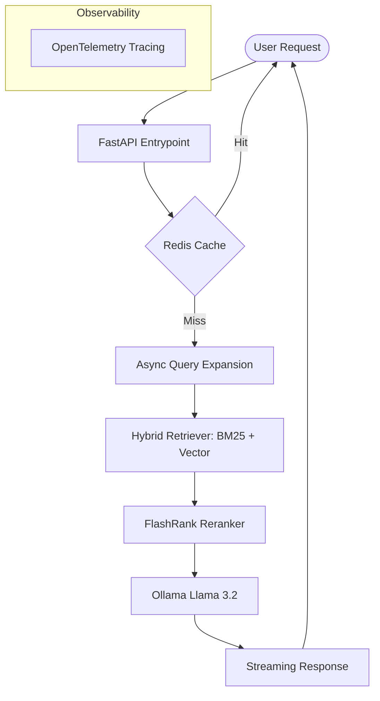

# 🚀 RAG Assistant: SQL & Python

[](https://www.python.org/)
[](https://fastapi.tiangolo.com/)
[](https://reactjs.org/)
[](https://redis.io/)
[](https://www.trychroma.com/)
[](https://opensource.org/licenses/MIT)

**A high-performance, production-ready RAG system designed for technical documentation. Chat with your SQL and Python knowledge base using local LLMs with enterprise-grade caching and observability.**

---

## 🎥 Demo / Preview


> *[Placeholder for GIF: High-speed streaming response with page-level citations]*

---

## 🤔 Why this project?

### The Problem
Traditional documentation search is often frustrating—users struggle with exact keyword matching or get overwhelmed by hundreds of pages of technical manuals. Modern AI chatbots often hallucinate when asked about specific versions or internal documentation.

### The Solution
This project solves this by building a **private, local-first RAG pipeline**. 
- **Privacy**: No data ever leaves your machine.
- **Accuracy**: Our hybrid retrieval (Vector + BM25) and reranking ensure the AI only sees the most relevant facts.
- **Performance**: We've optimized every millisecond—from background query expansion to semantic cache versioning.

---

## ✨ Key Features

- 🧠 **Hybrid Retrieval**: Combines BM25 keyword matching with ChromaDB vector search for maximum recall.
- ⚡ **Ultra-Low Latency**: Streaming responses via FastAPI SSE with optimized reranking fallbacks.
- ♻️ **Atomic Cache Versioning**: Redis-backed semantic caching that invalidates instantly on data updates.
- 🛰️ **Deep Observability**: Full OpenTelemetry tracing across the entire pipeline (Retrieval → Rerank → LLM).
- 🏗️ **Local First**: Powered by Ollama—keep your data private and avoid expensive API costs.
- 🛠️ **Production Hardened**: Token-aware context trimming, sliding-window history, and non-blocking query expansion.

---

## 🏗️ Architecture



---

## 🚀 Quick Start

### One-Click Startup (Recommended)

**Windows:**
```powershell
./'START APP.bat'
```

**Linux/macOS:**
```bash
./setup.sh
```

---

## ⚙️ Manual Installation

### 1. Prerequisites
- [Ollama](https://ollama.ai/) installed and running.
- [Node.js](https://nodejs.org/) (v18+)
- [Python](https://www.python.org/) (3.9+)
- [Redis](https://redis.io/) (Local or Docker)

### 2. Backend Setup
```bash
cd backend
python -m venv venv
source venv/bin/activate  # Windows: venv\Scripts\activate
pip install -r requirements.txt
cp .env.example .env
python initialize_db.py
```

### 3. Frontend Setup
```bash
cd frontend
npm install
npm run dev
```

---

## 🔧 Environment Configuration

| Variable | Default | Description |
|---|---|---|
| `OLLAMA_MODEL` | `llama3.2` | The local LLM to use |
| `REDIS_URL` | `redis://localhost:6379/0` | Connection string for Redis |
| `MAX_CONTEXT_TOKENS` | `3000` | Hard cap for RAG context window |
| `RERANKER_TIMEOUT_SEC` | `2.0` | Fallback timeout for reranking |
| `TRACING_BACKEND` | `otlp_console` | Tracing output (console/langsmith/none) |

---

## 🚀 Roadmap

- [ ] **Multi-modal RAG**: Support for images and vision-based document parsing.
- [ ] **Multi-user Auth**: JWT-based authentication for enterprise teams.
- [ ] **Deployment Templates**: One-click AWS/Azure/GCP terraform scripts.
- [ ] **Advanced GraphRAG**: Using Knowledge Graphs for complex relationship queries.

---

## 🤝 Contributing

Contributions are welcome! Please see our [CONTRIBUTING.md](CONTRIBUTING.md) for guidelines on branch naming and commit messages.

---

## 📄 License

This project is licensed under the MIT License - see the [LICENSE](LICENSE) file for details.

---

## 💎 Credits

Maintained by **Piyush Ramteke**.
Built for developers who care about RAG performance and privacy.
