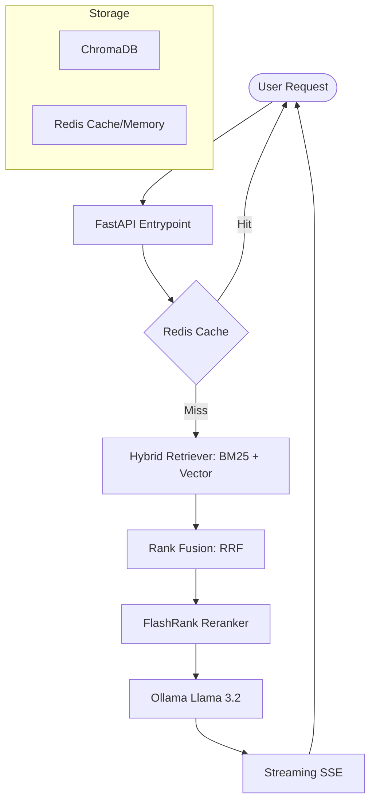

# 🚀 RAG Assistant: SQL & Python

[](https://www.python.org/)
[](https://fastapi.tiangolo.com/)
[](https://streamlit.io/)
[](https://redis.io/)
[](https://www.trychroma.com/)
[](https://opensource.org/licenses/MIT)

**A high-performance, production-ready RAG system designed for technical documentation. Chat with your SQL and Python knowledge base using local LLMs with enterprise-grade caching and observability.**

---

## 🎥 Demo / Preview

| Welcome Screen | AI Response |
| :---: | :---: |
|  |  |

> *Fast, locally-hosted RAG with streaming responses and page-level citations.*

---

## 🤔 Why this project?

### The Problem
Traditional documentation search is often frustrating—users struggle with exact keyword matching or get overwhelmed by technical manuals. Modern AI chatbots often hallucinate when asked about specific enterprise documentation.

### The Solution
This project provides a **production-grade, local-first RAG pipeline**. 
- **Privacy**: No data ever leaves your machine, powered by Ollama.
- **Accuracy**: Hybrid retrieval (Vector + BM25) with RRF and FlashRank reranking.
- **Performance**: Redis-backed semantic caching and asynchronous document ingestion.

---

## ✨ Key Features

- 🧠 **Hybrid Retrieval**: Combines BM25 keyword matching with ChromaDB vector search for maximum recall.
- ⚡ **Ultra-Low Latency**: Real-time streaming responses via FastAPI SSE.
- ♻️ **Semantic Caching**: Redis-backed caching to avoid redundant LLM calls.
- 🏗️ **Code-Aware Chunking**: Optimized separators for SQL, Python, and technical docs.
- ⚛️ **Premium UI**: Modern React frontend with Glassmorphism design and smooth animations.
- 🐳 **Docker Ready**: Fully orchestrated stack with Docker Compose.

---

## 🏗️ Architecture



---

## 🚀 Quick Start

### The Easiest Way (Docker)

1. **Clone the repo** and navigate to the root.
2. **Start the stack**:
   ```bash
   docker-compose up --build
   ```
3. **Access the UI**: Open `http://localhost:5173`
4. **Access the API**: Open `http://localhost:8000/docs`

---

## ⚙️ Manual Installation

### 1. Prerequisites
- **Ollama** installed and running (`ollama serve`).
- **Redis** running locally.
- **Python 3.11+** and **Node.js 20+**.

### 2. Backend Setup
```bash
cd backend
pip install -r requirements.txt
uvicorn main:app --reload
```

### 3. Frontend Setup
```bash
cd frontend
npm install
npm run dev
```

---

## 🔧 Core Components

| Layer | Technology |
|---|---|
| **API** | FastAPI (Python) |
| **Frontend** | React + Vite + Tailwind CSS |
| **Vector DB** | ChromaDB |
| **Embeddings** | BAAI/bge-small-en-v1.5 |
| **LLM** | Ollama (Llama 3.2) |
| **Cache/Memory** | Redis |
| **Reranker** | FlashRank |

---

## 🚀 Roadmap

- [ ] **Multi-modal RAG**: Support for images and vision-based document parsing.
- [ ] **Advanced GraphRAG**: Using Knowledge Graphs for complex relationship queries.
- [ ] **Multi-tenant Support**: RBAC and session isolation for enterprise teams.
- [ ] **OpenTelemetry**: Deep tracing across the entire pipeline.

---

## 🤝 Contributing

Contributions are welcome! Feel free to open issues or submit PRs.

---

## 📄 License

This project is licensed under the MIT License.

---

## 💎 Credits

Maintained by **Piyush Ramteke**.
Built for developers who care about RAG performance and privacy.
